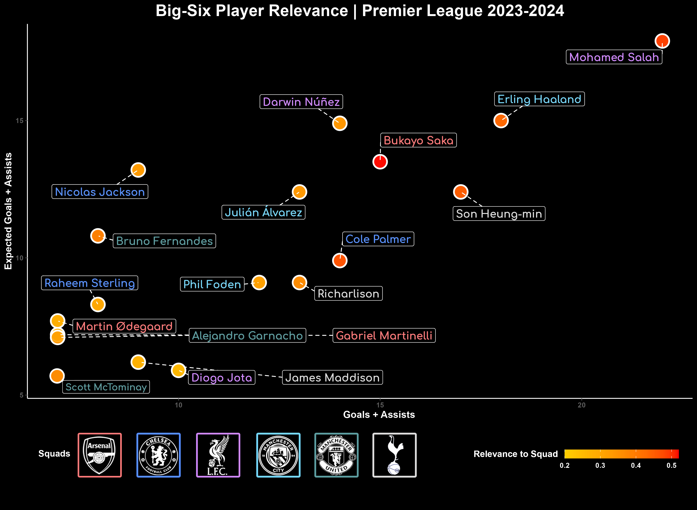

***

<font size=3> OVERVIEW

<font size=3> The code exemplifies a comprehensive data science workflow, encompassing ETL (Extract, Transform, Load), data analysis, and data visualization processes. It begins by scraping data from [fbref](https://fbref.com/en/comps/9/Premier-League-Stats) for the Premier League's big six teams. Following data acquisition, the code filters and cleans the dataset based on players from the 2023-2024 season who participated of Premier League competition. Subsequently, it removes incomplete or irrelevant data, aggregates goals and assists and selects the three players with more goals/assists per squad to calculates their individual contributions. Finally, the code conducts data analysis and data visualization, generating a scatter plot to illustrate player relevance based on their contributions relative to their respective squad's totals. The project provides insights into top players performance within the context of the Premier League 2023-2024.

***

<style>
body {
text-align: justify}
</style>
<font size=3>Install and/or Load packages:
```{r warning = FALSE, message = FALSE, results = 'hide'}
pack <- c('worldfootballR', 'openxlsx', 'dplyr','ggplot2','ggrepel')
vars <- pack[!(pack %in% installed.packages()[, "Package"])]
if (length(vars != 0)) {
  install.packages(vars, dependencies = TRUE)
} 
sapply(pack, require, character.only = TRUE)
```

<font size=3> Set the directory:
```{r}
setwd("C:/Users/Alícya/Desktop/Fabricio/Bioinformatics")
```

<font size=3> Define a condition: If we don't have the dataset we run the chunk who acquire the data from [fbref](https://fbref.com/en/comps/9/Premier-League-Stats) database, if we have we just load the dataset:
```{r}
if (!file.exists("PL_bigsix.xlsx")) {

#Select the teams: Arsenal, Chelsea, Livepool, Manchester City, Manchester United and Tottenham (Big-Six)
teams <- c("https://fbref.com/en/squads/822bd0ba/Liverpool-Stats",
           "https://fbref.com/en/squads/18bb7c10/Arsenal-Stats",
           "https://fbref.com/en/squads/b8fd03ef/Manchester-City-Stats",
           "https://fbref.com/en/squads/361ca564/Tottenham-Hotspur-Stats",
           "https://fbref.com/en/squads/19538871/Manchester-United-Stats",
           "https://fbref.com/en/squads/cff3d9bb/Chelsea-Stats")
  
#Extract URLs of each player
players_urls <- list()
  
for (i in teams) {
   players <- fb_player_urls(i)
   players_urls[[i]] <- players
 }
players_urls <- unlist(players_urls)
  
#Get each url from "fbref" database
PL <- fb_player_season_stats(players_urls, stat_type = "standard", time_pause = 2)

#Save file in xlsx format 
write.xlsx(PL, "PL_bigsix.xlsx")
  
  } else {

#Read the dataset
PL <- read.xlsx("PL_bigsix.xlsx")
    
}
```

<font size=3> Select only players present in Season 2023-2024 who play in the Premier League competition:
```{r}
PL_2324 <- subset(PL, Season == '2023-2024' & Comp == '1. Premier League')
```

<font size=3> Select and slice the dataset to retain only relevant variables to our analysis:
```{r}
PL_2324_filtered <- PL_2324[,c(1,5,12:14,23)]
```

<font size=3> Detect players without any game participation (NA values):
```{r}
na_rows <- complete.cases(PL_2324_filtered$Gls, PL_2324_filtered$Ast,PL_2324_filtered$`G+A`)
```

<font size=3> Select only players with games participations:
```{r}
PL_2324_nona <- PL_2324_filtered[na_rows, ]
```

<font size=3> Select columns to check players without goals/assists contributions (Zero values):
```{r}
columns_to_check <- c("Gls", "Ast", "G+A")
```

<font size=3> Identify and exclude players which no goals or assists contributions to each Squad:
```{r}
PL_2324_nozero <- PL_2324_nona[rowSums(PL_2324_nona[columns_to_check] != 0, na.rm = TRUE) > 0, ]
```

<font size=3> Select and Exclude Sheffield Utd Squad (not a big-six squad):
```{r}
PL_2324_nozero <- subset(PL_2324_nozero, Squad != 'Sheffield Utd')
```

<font size=3> Sum the values of Goals + Assists per Squad:
```{r}
Total_Goals_Assists_Per_Club <- aggregate(`G+A` ~ Squad, data = PL_2324_nozero, FUN = sum)
```

<font size=3> Insert a new column: total of Goals and assists per Squad:
```{r}
PL_2324_division <- merge(PL_2324_nozero,Total_Goals_Assists_Per_Club, by = "Squad")
```

<font size=3> Perform the division based in: G+A per player /  total of G+A of each Squad:
```{r}
PL_2324_division <- PL_2324_division %>%
                    mutate(Division_Result = `G+A.x` / `G+A.y`)
```

<font size=3> Remove duplicates based on the "Squad" column:
```{r}
PL_2324_division <- PL_2324_division %>%
                    distinct(player_name, .keep_all = TRUE)
```

<font size=3> Order the dataset per squad and individual contribution:
```{r}
PL_2324_top3 <- arrange(PL_2324_division, desc(Squad), desc(Division_Result))
```

<font size=3> Group per Squad and get the top three values of individual contribution per Squad:
  ```{r}
PL_2324_top3 <- PL_2324_top3 %>%
  group_by(Squad) %>%
  top_n(3, Division_Result) %>%
  slice(1:3)
```

<font size=3> Perform the division based in a mean of individual contribution of each Squad:
  ```{r}
PL_2324_top3 <- PL_2324_top3 %>%
  group_by(Squad) %>%
  mutate(Relevance = Division_Result / sum(Division_Result))
```

<font size=3> Plot in R + Adjusts in Photoshop:
  ```{r warning = FALSE, message = FALSE, fig.show='hide'}
ggplot(PL_2324_top3, aes(x = `G+A.x`, y = `npxG+xAG_Expected`, color = Relevance)) +
  geom_point(aes(fill =Relevance),pch=21,colour="white",size=7, stroke=1.5,alpha = 9/10) +
  scale_fill_gradient2(low = "black", mid = "yellow", high = "red", breaks = c(0.2,0.3,0.4,0.5), limits = c(0.2, 0.52))+
  geom_label_repel(aes(label = player_name, family = "Comfortaa"),fontface = "bold", size = 4.6, box.padding = 1.2,segment.linetype = 2,segment.square = F,
                   max.overlaps = 10, colour = "white", fill = "black")+
  labs(title = "Big-Six Player Relevance | Premier League 2023-2024", fill = "Relevance", x = "Goals + Assists", y = "Expected Goals + Assists")+
  theme(
    plot.title = element_text(hjust = 0.5, size = 17),
    plot.background = element_rect(fill = "black"),
    panel.background = element_rect(fill = "black"),
    axis.line = element_line(color = "white"),
    axis.title = element_text(face = "bold",size = 12),
    panel.grid.major = element_line(color = "gray", size = 0.2),  # Adjust grid line color and size
    text = element_text(color = "white", family = "Arial", face = "bold"),  # Set font family to Times New Roman
    legend.key = element_rect(fill = "black", color = NA),
    legend.background = element_rect(fill = "black"))+
  theme(
    panel.grid.major = element_blank(),
    panel.grid.minor = element_blank())+
  theme(legend.key.height = unit(1, "lines"),legend.key.width = unit(10, "mm"), legend.position = "bottom")
```

\

```{r echo = F}

```

***

<font size=3> INSIGHTS

<font size=3>Mohamed Salah (Liverpool) emerges as a player with the most direct involvements in goals, followed by Erling Haaland (Manchester City) and Son Heung-min (Tottenham). These players often contribute the most to goal-scoring opportunities and can single-handedly change the outcome of matches.

<font size=3>The Arsenal squad shows more numerical divergence in player contributions, with Bukayo Saka standing out as a more relevant player. In clubs where there is a significant difference in player contributions, the lower performance of specific key players can lead to inconsistency in results.

<font size=3>Manchester United appears as a more balanced squad, with all top players presenting similar relevance to the team. A more balanced squad, suggests that the team's performance is not overly reliant on individual players. When top players contribute equally, it can lead to a more stable and consistent performance overall, as there is less pressure on any single player to carry the team.

***

<div style="text-align: center;">
<font size=3> More scripts can be found on my [GitHub](https://github.com/fabricioA14) profile


